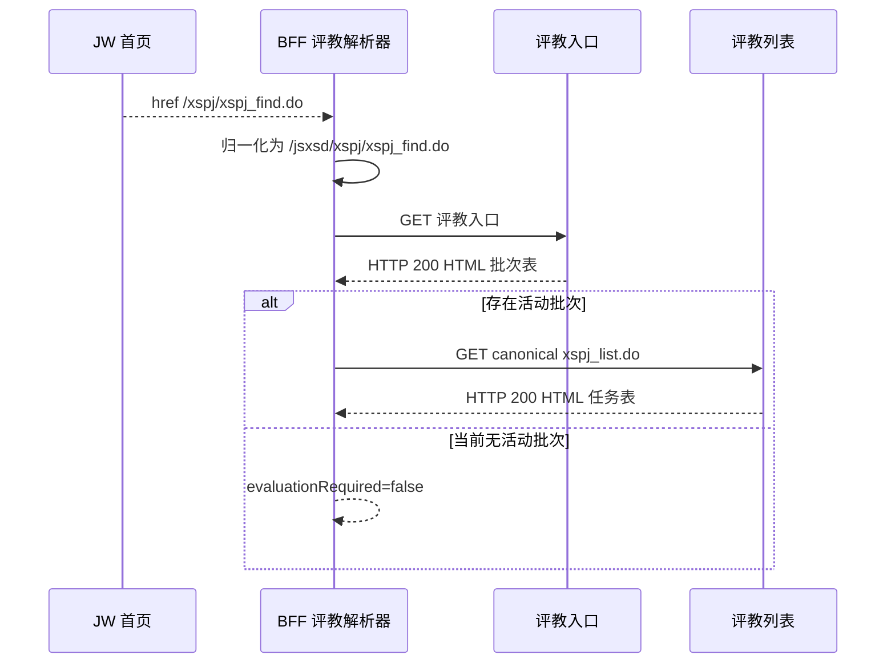

# HUAS 官方 JW 接口格式逆向与 BFF 兼容报告

> 分析日期：2026-08-09
> 范围：官方教务 JW 页面与既有 BFF 的校园适配层
> Case：`/Users/xiangyun/Desktop/superwl/work/20260809-huas-bff-api-contract/`
> 说明：本报告只记录接口结构与解析语义，不记录凭证、Cookie、姓名、学号关联 ID 或成绩值。

## 1. 执行摘要

本次直接观察官方 JW，而不是重新评审 BFF 架构。官方接口的共同特征是“HTTP 200 但以 HTML 为主”：课表空态和成绩是 HTML，空教室级联接口虽然返回 JSON 形状却仍声明 `text/html`。现有课表、成绩、空教室适配器与实测结构一致；唯一确认的兼容缺口是首页评教菜单使用 `/xspj/...` 短路径，而实际可用入口是 `/jsxsd/xspj/...`。该缺口已在解析边界归一化，并通过回归测试。

## 2. Scope 摘要

详见 case [scope.md](/Users/xiangyun/Desktop/superwl/work/20260809-huas-bff-api-contract/scope.md)：授权状态为 `granted`，网络模式为 `authorized_target_only`，范围限定为官方 JW 主机及本地 BFF 源码。

本轮只读观察了页面和业务请求；没有提交评教、修改教务数据、爆破、压测或跨用户访问。

## 3. 官方接口矩阵

| 页面/接口路径 | 方法 | 实测响应 | 结构结论 |
|---|---:|---|---|
| `/jsxsd/framework/xsMain.jsp` | GET | 200 HTML | 框架页；菜单出现 `/xspj/xspj_find.do` 短路径。 |
| `/jsxsd/framework/xsMain_new.jsp` | GET | 200 HTML | 页面包含教学周历空态，并引用课表加载接口。 |
| `/jsxsd/framework/main_index_loadkb.jsp` | POST | 200 HTML | 参数名为 `rq`、`sjmsValue`；当前返回 `课表暂未公布` 的 64 字节 HTML 空态。 |
| `/jsxsd/kbxx/jsjy_query` | GET | 200 HTML | `Form1` POST 到 `/jsxsd/kbxx/jsjy_query2`，包含学期、校区、楼栋、教室、周次、星期、节次和节次模式字段。 |
| `/jsxsd/kbxx/jsjy_processAjax` | GET | 200 HTML | `requestType=jxl` 返回 49 项 JSON 数组；`requestType=newjs` 返回 40 项 JSON 数组；单项均为 `{ dm, dmmc }`。 |
| `/jsxsd/kbxx/initJc` | GET | 200 HTML | JSON 对象 `{ mtdjs: number, success: boolean }`。 |
| `/jsxsd/kbxx/jsjy_query2` | POST | 200 HTML | 默认查询返回 736 行结果 HTML；本地空教室解析器得到 553 个正常教室对象。 |
| `/jsxsd/kscj/cjcx_list` | POST | 200 HTML | `#dataList` 表格 58 行（含表头）、16 列；本地成绩解析器得到 57 个结构有效条目。 |
| `/jsxsd/xspj/xspj_find.do` | GET | 200 HTML | 评教批次页，7 列表头和 `pageIndex` 控件；本次账号没有产生可用批次列表 URL。 |

### 响应语义

BFF 不能只看状态码或 `Content-Type`：

- `main_index_loadkb.jsp` 的“课表暂未公布”是成功的业务空态，不是异常。
- 成绩和评教页面需要先识别登录页、评教阻断文案和 `dataList` 结构，再进入表格解析。
- 空教室级联接口要先尝试 JSON，再回退 HTML option/表格解析；声明为 HTML 不代表一定是 HTML。
- 对外 BFF 应继续输出稳定 JSON 领域对象，不应把上游 HTML 或错误页直接透传给客户端。

## 4. 核心发现

### F-001

- title: 首页评教短路径需要归一化
- severity: medium
- category: design
- status: validated
- evidence_ids: [E-003]
- location: `src/modules/campus-integrations/jw/parsers/evaluation-parser.ts`
- impact: 若直接使用首页 `/xspj/xspj_find.do`，官方返回登录失效页；评教发现可能误报没有批次。实际可用入口为 `/jsxsd/xspj/xspj_find.do`。
- confidence: high
- remediation: 已让评教入口和列表 URL 提取同时接受短路径与 canonical 路径，并统一归一化到 `/jsxsd/xspj/...`；新增短路径回归测试。

### F-002

- title: 官方 JW 是混合 HTML/JSON 的 HTTP 200 协议
- severity: info
- category: reverse_algo
- status: validated
- evidence_ids: [E-001, E-002]
- location: 官方 JW 页面与 `/jsxsd/` 业务接口
- impact: 仅按 HTTP 状态码或 Content-Type 判断会把业务空态、JSON 形状的 HTML 响应和错误页混在一起。既有课表、成绩、空教室 parser 已按正文语义处理。
- confidence: high
- remediation: 保持 body-aware parser；后续上游改版优先更新 fixture 和 parser，不改变对外稳定响应包。

## 5. Evidence 证据链

| E-id | source_ref | repro_command | content_hash |
|---|---|---|---|
| E-001 | `case/evidence/E-001.md`；官方接口结构快照 | `bun run work/20260809-huas-bff-api-contract/notes/official-endpoint-probe.ts` | `sha256:d1a791f804e859dfb764a061633b9395d02dc492ff7f40909961994800c9fe8b` |
| E-002 | `case/evidence/E-002.md`；官方响应经本地 parser 的 shape-only 结果 | 同上 | 同上 |
| E-003 | `case/evidence/E-003.md`；首页评教短路径与 canonical 入口差异 | `bun test --preload ./tests/setup.ts ./tests/evaluation-parser.test.ts` | 同上 |

原始观察快照位于 case `notes/official-contract-observation.md`，已脱敏并固定 SHA-256。完整 Evidence 字段、时间线和工作项见 case 目录。

## 6. Path 调用链

### P-001

- title: 首页菜单到评教批次发现
- path_type: callflow
- start: `/jsxsd/framework/xsMain.jsp`
- goal: 找到 canonical 评教列表 URL，且不执行提交
- steps:
  1. 读取首页菜单，发现 `/xspj/xspj_find.do` — evidence: E-003 — finding: F-001
  2. 归一化为 `/jsxsd/xspj/xspj_find.do` — evidence: E-003 — finding: F-001
  3. 读取评教入口批次表 — evidence: E-001 — finding: none
  4. 若有活动批次，再读取 canonical `xspj_list.do`；本次没有活动批次 URL — evidence: E-001 — finding: none
- residual_risks: 活动评教列表和评教表单只用离线 fixture 验证，本轮未对上游执行提交。

### P-002

- title: JW 混合响应到稳定领域对象
- path_type: callflow
- start: 官方 JW 业务接口
- goal: 生成稳定 BFF 结果或明确上游/会话错误
- steps:
  1. 课表 POST 使用 `rq`、`sjmsValue`，解析 HTML 空态 — evidence: E-001,E-002 — finding: F-002
  2. 成绩 POST 解析 16 列 `dataList` — evidence: E-001,E-002 — finding: F-002
  3. 空教室级联接口按 JSON 形状、HTML 类型和 HTML 表格分别处理 — evidence: E-001,E-002 — finding: F-002
- residual_risks: 官方 HTML 版式变化仍需补充 parser fixture；个人数据不写入本 case 快照。

## 7. 修复与验证

### 代码变更

- `src/modules/campus-integrations/jw/parsers/evaluation-parser.ts`
  - 评教 entry/list 提取正则接受 `/xspj/...` 别名。
  - 统一调用菜单路径归一化逻辑，输出 canonical `/jsxsd/xspj/...`。
- `tests/evaluation-parser.test.ts`
  - 新增首页 `/xspj/xspj_find.do` 到 canonical 入口的回归用例。

### 验证结果

- `bun run typecheck`：通过。
- 相关 parser 测试：32 passed，0 failed。
- `bun run test`：319 + 2 + 66 passed，0 failed。
- case-review 严格审查：在报告生成后再次执行，目标为 0 error、0 warning。

## 8. 可视化链路

可编辑 Mermaid 源文件：[2026-08-09_huas-jw-callflow.mmd](2026-08-09_huas-jw-callflow.mmd)

## 9. 遗留事项

- 本次账号当前没有活动评教批次，因此没有取得真实 `xspj_list.do` 的活动 query 样例；不要把离线 fixture 的示例值当作本次账号数据。
- 后续若要继续，只需在出现活动批次时补一次只读 list/form 结构观察；提交动作必须另行明确授权，本报告不包含该动作。
